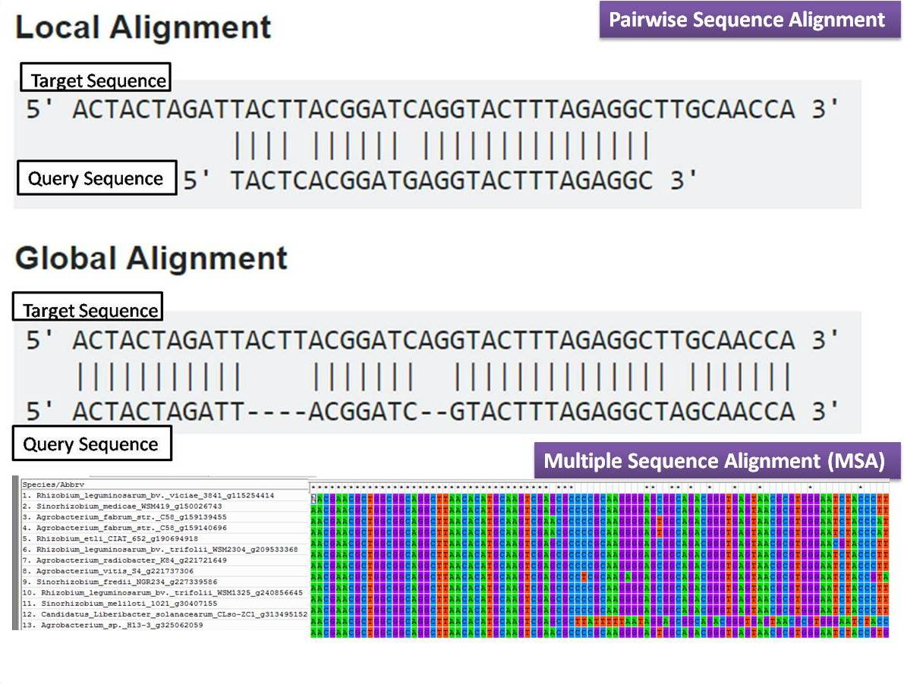
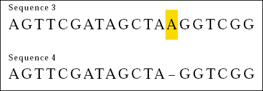

Las bases de datos están llenas de secuencias biológicas, pero ¿cómo
analizar esa información? Aquí aprenderemos algunos análisis básicos que nos
pueden dan información muy útil sobre la Biología.

## Introducción

Ya conocimos diferentes bases de datos con información biológica; sin
embargo, estos datos solo son útiles si son analizados. Debido a la gran
cantidad de datos existentes y a la necesidad de hacer múltiples cálculos y
procedimientos rápidamente, la mayoría de análisis de datos biológicos en la
actualidad se realizan con la ayuda de programas computacionales y
algoritmos capaces de procesas grandes cantidades de información. A pesar de
esto, sigue siendo esencial que los investigadores y en general usuarios de
estos programas, comprendan aspectos básicos de su funcionamiento y las
teorías biológicas en las que se fundamentan para poder interpretar
adecuadamente sus resultados.

En este práctica conoceremos algunas de las herramientas más útiles para el 
análisis de secuencias biológicas.

## Objetivos

1. Conocer métodos de análisis de secuencias biológicas.
2. Conocer herramientas para el análisis de secuencias biológicas.
3. Comprender en qué consiste un alineamiento de secuencias y su relevancia
   para entender la biología de un organismo y su evolución.

## Alineamiento de secuencias

El alineamiento de secuencias consiste en hacer concordar lo mejor posible
dos o más secuencias, tanto de ADN como de proteína y son una de las formas 
más comunes de comparar dos o más secuencias biológicas.

¿Cuál es el propósito o la utilidad de hacer un alineamiento de secuencias?

Los alineamientos permiten obtener información filogenética, estructural y
funcional, y siguen siendo uno de los principales análisis bioinformáticos 
realizados en diversos estudios biológicos.

### Alineamiento local vs. alineamiento global.

Veamos varios tipos de alineamientos:

{.lightbox}

¿Cómo alinear secuencias?

{.lightbox}

::: {.callout-warning collapse="true"}

#### Y si las alineamos así...

{.lightbox}

¿Cuál alineamiento parece mejor y por qué?

:::

### Ejercicio

Busquemos secuencias (por ejemplo del gen Smaug) en la base de datos
[OrthoDB](https://www.orthodb.org/?) y hagamos un
[alineamiento con MAFFT](https://www.ebi.ac.uk/Tools/msa/mafft/).

Para visualizar el alineamiento vamos a usar el software gratuito
[JalView](https://www.jalview.org/).

## [BLAST](https://blast.ncbi.nlm.nih.gov/Blast.cgi) (Basic Local Alignment Search Tool)

BLAST es una herramienta del NCBI que permite hacer búsqueda de secuencias
por similaridad, tanto para secuencias de ADN como para secuencias de
proteínas. Local significa que se alinean solo segmentos de las secuencias.

Hagamos un BLAST:

```
>Secuencia misteriosa 1
GCCTCTCATACTAGGAGCTCCTGACATAGCCTTCCCACGATTAAATAATATAAGATTTTGACTACTGCCC
CCCTCTTTAACTCTTCTTATTATAAGAACACTAGCTGATAAAGGAGCAGGAACTGGGTGAACAGTCTACC
CACCTCTGTCTGCAAATTTGGCCCATGAAGGAACATCTGTAGATTTAGCCATCTTCAGTCTCCATATAGC
AGGAGTCTCTTCTATCTTAGGAGCTATAAATTTCATCTCTACAATTATCAATATACGGCCGAAAGGTATA
AGGACAGATCGAATACCTTTATTTGTATGAGCAGTGCTAATCACTGCCATTCTATTACTTCTTTCTTTAC
```

```
>Secuencia misteriosa 2
QIHRQISSTSPANRVSPASILASPSPPAPTSPSSSSISVRKKLPSGTKQKPLPPKSSSSKLSSPVAVQDE
IEIEIAEVLYGMMRMPSTSKQEAAGNDLTEAAKSTVEVKSRVSSPISNPQTLPQSSITLAANSSSSNVSA
IAPKRKKPRHVKYEDDNSSRVTTIKSEAEAPSKSQVPFSNQLKSSGSGEGNSSVLDSIIPLTRESNASLD
SEKKENNLSKDETILPKVESSSGFRSDGEGAKSSSPEKEKFEIDLMAPPPVRSSSERGGEMMECVAAEAK
PKVTEVETEAKPLLKEDRSDPAIHDSQEKKRPRMVAEAEHHKFERNCELKLDLDKSDHVGLVNKHHVQKP
PPQQQLSVPDKTAQASHLPLHMSMPGWPGGLPTMGYMAPTQGVVP
```

```
>Secuencia misteriosa 3
ACCAGAAGAGCACCGAACTGCTCATCCGCAAGTTGCCCTTCCAGCGACTGGTCCGCGAAATCGCCCAGGA
CTTCAAGACCGACCTACGCTTCCAGAGCTCCGCCGTCATGGCGCTGCAGGAAGCCAGCGAGGCCTACCTG
GTCGGCCTCTTCGAGGATACCAATCTCTGCGCCATCCACGCCAAGCGG
```

```
>Secuencia misteriosa 4
TMYLILGAWSAMLGTALSMLIRAELGQPGSLIGDDQIYNVIVTAHAFIMIFFMVMPIMIGGFGNWLVPLM
LGAPDMAFPRLNNMSFWLLPPSLTLLLAGSAVENGAGTGWTVYPPLASNMAHAGASVDLTIFSLHLAGAS
SILGAINFITTVINMRTQGMTMERMPLFVWAVFITAFLLLLSLPVLAGAITMLLTDRNLNTSFFDPAGGG
DPILYQHLFWFFGHP
```

```
>Secuencia misteriosa 5
ILYFMFGMWAGMIGMSMSLIIRMELSTSGSILKNDQIYNGMVTLHAFIMIFFMVMPIMIGGFGNWLIPLM
LGAPDMAFPRMNNMSFWLLIPSLLFLLMSGIINTGVGTGWTMYPPLSSLIGHNSISIDMSIFSLHLAGAS
SIMGAINFISTIFNMN
```

Para una información más detallada sobre cómo usar BLAST descarga [este 
documento](https://blast.ncbi.nlm.nih.gov/Blast.cgi?CMD=Web&PAGE_TYPE=BlastDocs&DOC_TYPE=ProgSelectionGuide).

## Búsqueda de homología con [HMMER](http://hmmer.org/)

En muchas ocasiones nos interesa conocer la estructura o función de una
secuencia de ADN o de una proteína. Un paso importante para conocer mejor
las secuencias de nuestro interés es compararla con otras secuencias
conocidas y detectar homologías (es decir, parentesco o relaciones
evolutivas). HMMER es un programa que usa modelos estadísticos basados en
[cadenas de Markov](https://www.nature.com/articles/nbt1004-1315) para
comparar una secuencia de interés con secuencias depositadas en las bases de
datos para detectar homologías.

## Online vs. Local

¿Es mejor usar herramientas disponibles en la web o instalar el programa en
nuestro propio computador?


## Recursos adicionales

<https://viralzone.expasy.org/e_learning/alignments/content.html>
