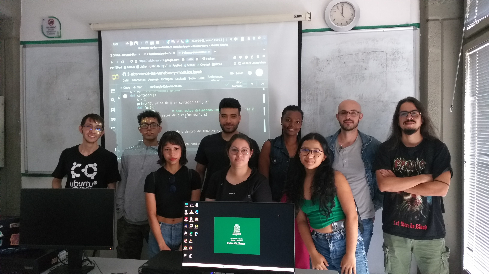

This semester, I offered a Python course at the Institute of Biology at the
University of Antioquia. At first, I thought there were not many people
interested; however, on the first day of the course, the room was plenty of
people, so much so that all the chairs were taken and many had to sit down
on the floor.

There were in total more or less 40 people, and this suggests to me that
Biology students at the University of Antioquia are claiming for courses on
subjects about programming and digital technologies.

As there were many people, I decided to create two groups, one from 10:00 to
12:00, and the other from 13:00 to 15:00. However, I knew that desertion was
to start at some point.

As predicted, some students didn't return, but a large group of them is
still actively participating in the course and are making big advances in
learning Python, so I feel very proud of them.

This is one of the efforts to promote Computational Biology and I feel very
glad with this experience. Here is a photo of me and some of the students:

