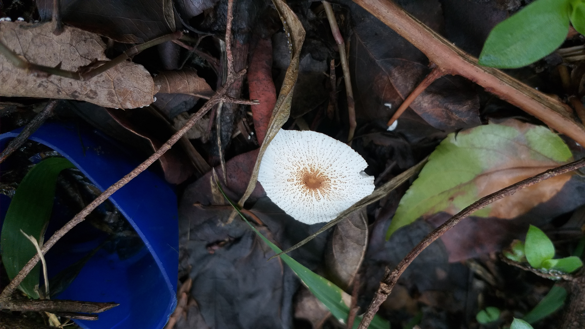
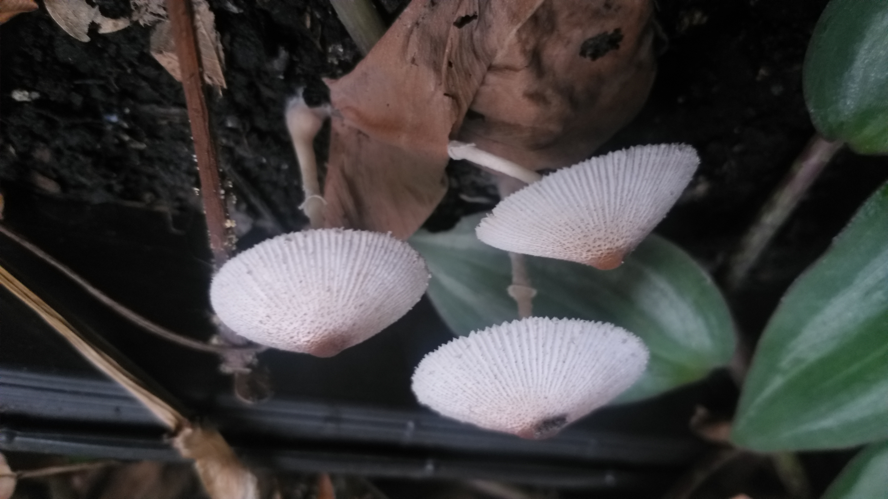
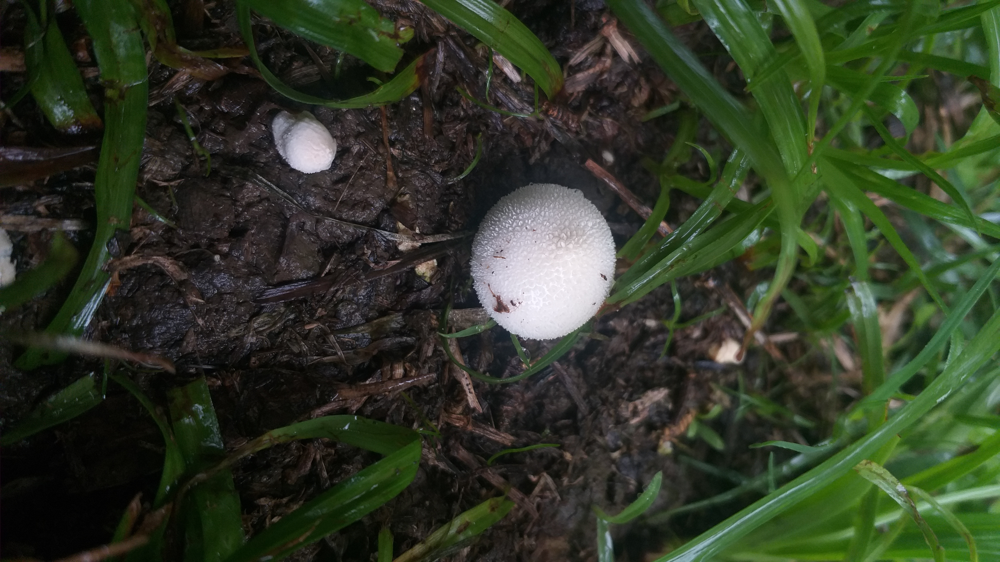
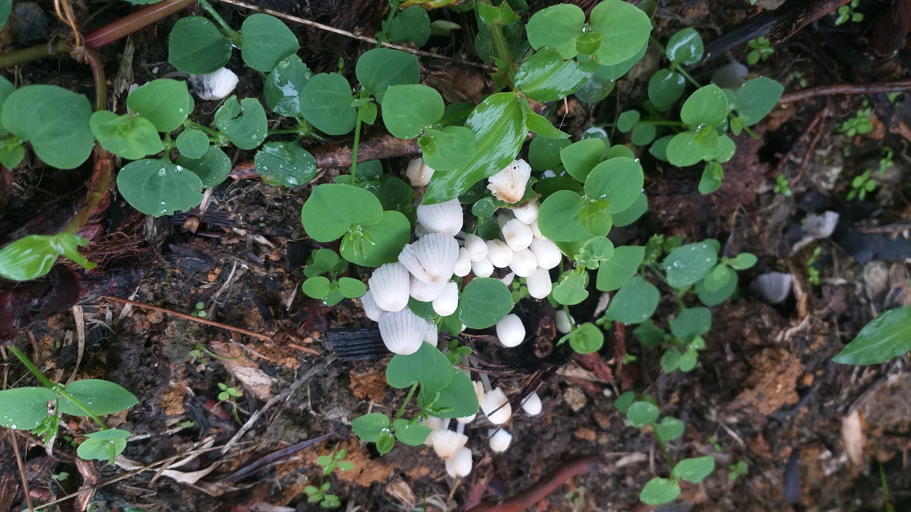

Este 2024 comenzó con un fuerte fenómeno del niño que nos trajo sequía y
racionamiento de agua. Apenas hace pocas semanas (últimas semanas de Abril y
primeras semanas de Mayo) ha comenzado de nuevo a llover, y esto ha causado
una sensación en el mundo de los hongos. Ahora todos están fructificando por
montones en muchas partes. En este post les mostraré algunos de los hongos
que he visto y colectado cerca a mi casa en la ciudad de Medellín.

{.preview-image}

Este *Agaricus* era verdaderamente grande:

Hasta fructificaron unos hongos en una de las materas de mi casa:

Al día siguiente ya el píleo se había abierto por completo:

Aquí tenemos un *Lycoperdon*:

Y también unos bellos *Coprinellus*:

Lo que quiero hacer es aprender algo de QGIS y crear un mapa de la zona para
reportar las localizaciones exactas de las especies que he visto y tal vez
hacer un seguimiento temporal.

Puedes descargar un manual de colecta de hongos en [este
enlace](https://jbb.gov.co/nosotros/publicaciones/manual-de-hongos-con-laminillas/).
