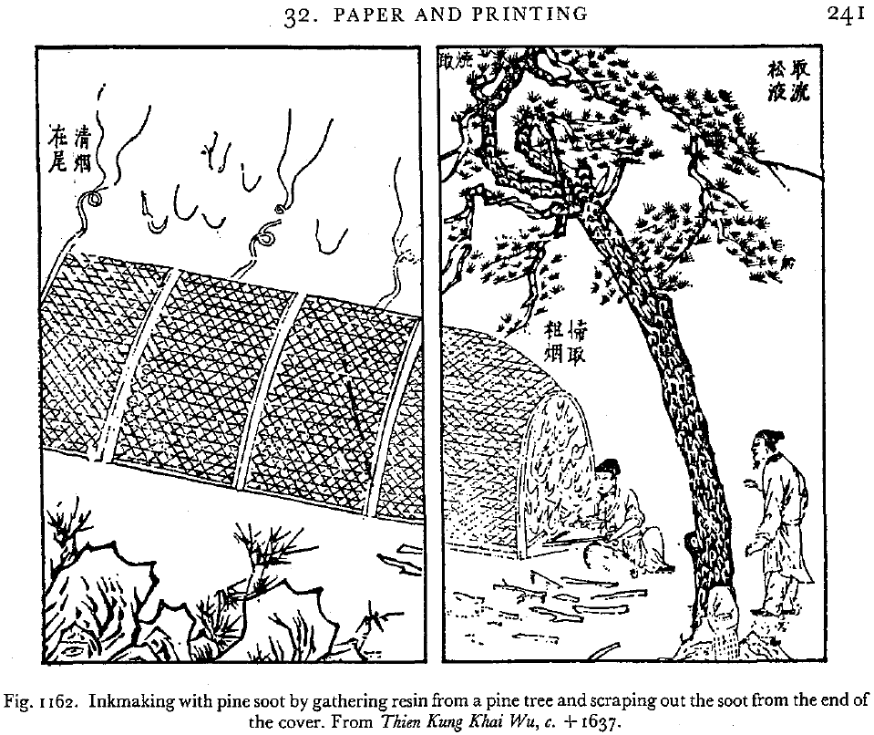
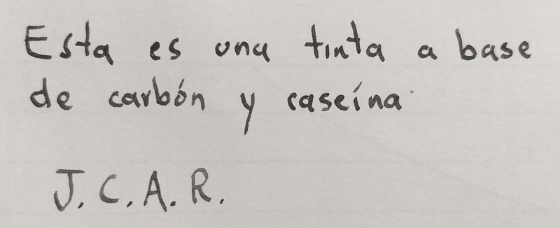

Desde hace miles de años los seres humanos hemos fabricado tintas para
pintar nuestra piel, para pintar las paredes de las cuevas, y más
recientemente para registrar nuestras vivencias en papel.

Hace un tiempo leí [*La ciudad del pez
elefante*](https://www.casadellibro.com.co/libro-la-ciudad-del-pez-elefante/9788483067666/1256375),
un libro maravilloso sobre papiros encontrados en lo que alguna vez fue la
ciudad de Oxirrinco en Egipto. Me impresionó lo bien conservados que estaban
muchos papiros, y me empecé a cuestionar qué tipos de tintas se usaban en la
antigüedad y cómo se hacían estas tintas; además, me pregunté también qué
tipos de tintas son más duraderas y por qué. En esta entrada discutiré estos
asuntos, así que, si no te parecen muy aburridos, comencemos.

Uno de los tipos de tinta antigua que conocí en mi investigación es la
[tinta ferrogálica](https://es.wikipedia.org/wiki/Tinta_ferrog%C3%A1lica),
una tinta que se hizo muy famosa durante la edad media, es fabricada
mediante un complicado proceso a base de agallas de plantas y minerales de
hierro. Esta tinta sin embargo tiene el problema de, además de ser más
complicada de fabricar, dañar el papel debido a su acidez, lo que hace que
documentos escritos en el siglo XVIII hoy en día se estén degradando debido
a que se usó tinta ferrogálica.

{fig-align="center"}

A pesar de ser un fanático de la tecnología y de la ciencia, una parte de mí
detesta la gran dependencia que de estas tiene nuestra sociedad moderna, y
al vivir el día a día siempre me pregunto cómo hacían los seres humanos hace
miles de años para vivir su vida sin fábricas industrializadas, sin
tecnología de punta, y teniendo que usar los recursos que tenían a la mano
para hacer todo lo que hacían. Por esta razón me propuse hacer mi propia
tinta con materiales o recursos "primitivos" y que fueran fáciles de
encontrar. Como se podrán imaginar, la tinta ferrogálica no era una opción
fácil de elaborar.

Otras tintas de la antigüedad de la que encontré reportes fueron las tintas
de sepia, que como su nombre lo indica, eran simplemente el líquido oscuro
que utilizan las sepias para confundir a sus predadores. Obviamente ya se me
habían acabado las sepias que estaba criando en el lavamanos de mi casa y no
pude tener esta tinta.

Seguí con mi investigación, y por cierto un muy muy buen libro sobre el tema
es [Inks, Their Composition and
Manufacture](https://archive.org/details/inkstheircomposi00mitcrich/page/n3/mode/2up).
En estas fuentes se habla también de una tinta extremadamente antigua, que
ha sido usada por egipcios, árabes, chinos y griegos, y que ha demostrado una
durabilidad notable.

El siguiente es uno de los [papiros de la ciudad
Oxirrinco](https://es.wikipedia.org/wiki/Papiros_de_Oxirrinco), y fue
escrito en el siglo III, usando este tipo de tinta.

{fig-align="center"}

{width=80% fig-align='center'}

Con esta misma tinta el artista Cheng Rong realizó esta hermosa obra de arte
llamada ["Nine
Dragons"](https://es.wikipedia.org/wiki/Nueve_Dragones_(pintura)). Es del
año 1244 y al día de hoy parece como nueva:

{.preview-image}

Ya se imaginarán que la tinta de la que hablo es la conocida como *tinta
china*, aunque muchas civilizaciones (no solo la china) usaron en realidad
el mismo tipo de tinta, y es que además de ser muy duradera, su elaboración
es relativamente sencilla, pues su principal ingrediente es el carbón.

El carbón es bastante inerte químicamente, por lo que las tintas basadas en
carbón pueden durar miles de años sin verse afectadas por la exposición a la
luz o a la humedad. Además, permiten la datación basada en carbono 14.

## Experiencias haciendo tinta

Inicialmente intenté hacer tinta quemando pequeñas ramas secas, triturando
el carbón, y luego mezclándolo con resina de araucaria disuelta en agua.

Esta tinta no fue muy exitosa por varias razones:

1. El carbón producido por la quema de las ramas no era del todo negro, sino
   que había carbón de tono grisáceo, que hacía que la tinta no fuera tan
   oscura.

2. Las partículas de carbón eran bastante grandes. Para una buena tinta,
   entre más pequeñas las partículas de carbón, mucho mejor. A pesar de que
   intenté triturar los pedazos de carbón con un molcajete, este método no
   es suficiente para producir partículas tan finas, y por esta razón el
   carbón se iba precipitando y dejando una capa acuosa muy clara que no
   servía mucho como tinta.

3. La resina de araucaria no fue un buen agente aglutinante, no aglomeraba
   las partículas de carbón adecuadamente y además en unos pocos días se
   empezó a descomponer por la acción de los microorganismos.

### La victoria final

Finalmente llegué a una tinta de buena calidad y muy fácil de hacer. Luego de
estudiar [cómo se fabrica la tinta tradicional en
Japón](https://youtu.be/GSuFSYY-X9w) decidí no volver a quemar material
sólido sino usar una simple lámpara de aceite para producir hollín. Luego,
como quería algo más sencillo que producir pegamento a partir de pieles
animales, pensé en qué otro pegamento proteico podría usar y se me ocurrió
usar [pegamento de
caseína](https://www.acs.org/content/dam/acsorg/education/outreach/celebrating-chemistry/2020-ncw/2020-ncw-activity-making-glue-at-home-spanish.pdf),
un tipo de pegamento que conocía porque se usa en carpintería y que es
realmente sencillo de producir a partir de leche.

Con estos simples ingredientes logré hacer mi propia tinta y quedé muy
satisfecho, ahora intento usarla siempre que escribo:

{width="80%" fig-align="center"}
