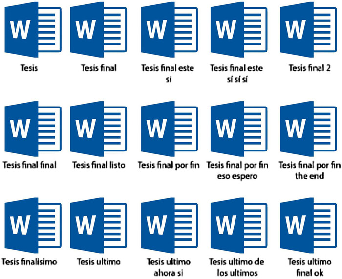
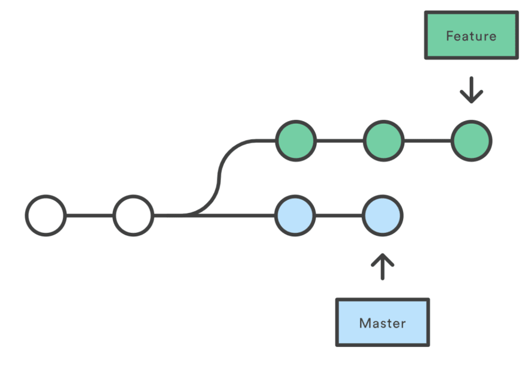

## ¿Qué es el control de versiones?

Seguramente ustedes ya han realizado "control de versiones", y muy
probablemente haya sido algo como esto:

{width=50% fig-align="center"}

Dado que este sistema no es muy útil, se han creado programas que permiten
hacer un control de versiones sobre los proyectos en los que trabajemos. Git
es el más usado de ellos, y aunque fue creado pensando en desarrolladores de
software, es muy útil en diferentes contextos.

## Empezando con Git

Instalar Git es muy fácil:

::: {.panel-tabset}

### En Linux
Si no lo tenemos instalado lo instalamos con el comando:

```bash
sudo apt install git
```

Podemos verificar si funcionó la instalación con el comando:

```bash
git --version
```

### En Windows
Puedes descargar el instalador de Git en [este
enlace](https://git-scm.com/download/win).

En el proceso de instalación podemos dejar la configuración por defecto y
luego de finalizar buscamos en el menú de Windows la aplicación **Git Bash**.

### En MacOS
Primero, asegúrate de tener instalado [homebrew](https://brew.sh/). Luego
ejecuta el siguiente comando en una terminal:

```zsh
brew install git
```

Podemos verificar si funcionó la instalación con el comando:

```zsh
git --version
```

:::

Empecemos a usar Git con unos pequeños ejemplos. En primer lugar vamos a
crear un nuevo proyecto, cualquier cosa en la que estemos trabajando.

```bash
# Crear una carpeta que será nuestro repositorio de ejemplo
mkdir proyecto
```

Si es la primera vez que usamos Git en nuestro computador, debemos ejecutar
los siguientes comandos para definir nuestro nombre de usuario y nuestro
email:

```bash
git config --global user.name "Godzilla Pérez"
git config --global user.email "godzilla@gmail.com"
```

Después de hacer esto podemos comenzar a usar Git y nuestro primer paso será
indicarle a Git que queremos hacerle un seguimiento a la carpeta donde
estamos y todo lo que pongamos en ella, para ello usamos el comando `git
init`:

```bash
cd proyecto
git init
```

Observemos que se creó una nueva carpeta llamada `.git`, recordemos que en
Linux todos los archivos que comiencen con un punto se consideran archivos
ocultos y los programas no los muestran.

En `.git` es donde Git almacenará todos los datos para poder hacer el
control de versiones de nuestro proyecto. Ahora aprenderemos el comando `git
status` que nos permite ver el estado de nuestro repositorio:

```bash
git status
```

¿Rama master? ¿Commits? ¿git add? ¿Qué es todo esto? En un momento lo
veremos.

## Haciendo seguimiento a los archivos

Ahora vamos a crear un nuevo archivo de texto en la carpeta del proyecto,
por ejemplo `cuento.txt`:

```{.txt filename='cuento.txt'}
Cuando despertó, el dinosaurio todavía estaba allí.

--Augusto Monterroso
```

Nos dice que hay un nuevo archivo pero que no se está realizando seguimiento
para ver sus cambios. Así que le empezamos a hacer seguimiento con `git add
<archivo>`:

```bash
git add cuento.txt
```

También podemos usar el comando `git add *` o `git add .` si queremos añadir
todos los archivos que hayan en la carpeta donde estamos.

Volvamos a ver de nuevo el estado de nuestro proyecto:

```bash
git status
```

¿Área de stage?

## Panorama de trabajo de Git

Internamente, Git crea un índice con los archivos a los que se les está
haciendo seguimiento, a este índice se le llama el área de "Stage". Cuando
ejecutamos `git add cuento.txt`, Git añade el archivo `cuento.txt` al
índice. ¡Ahora estamos listos para hacer nuestro primer commit!


### ¿Qué es un commit?

Un commit es básicamente un registro de cambios. También podemos pensar en
un commit como una "foto" de nuestro proyecto en un momento dado, los
commits son los que nos permitirán llevar un registro de los cambios y
volver a versiones anteriores de nuestros archivos.

Hagamos el primer commit:

```bash
git commit -m 'Añadir el archivo cuento.txt'
```

Los mensajes de los commits deberían ser útiles y explicar el cambio que se
está registrando. En [este
enlace](https://www.conventionalcommits.org/es/) puedes encontrar más
información sobre cómo escribir un buen commit.

Veamos de nuevo el estado del repositorio:

```bash
git status
```

Podemos ver el historial de commits con el comando `git log`:

```bash
$ git log
commit 54ec0016d7629b175d435a4214056e85b1027a1d (HEAD -> main)
Author: Juan Camilo Arboleda Rivera <juan.arboleda2@udea.edu.co>
Date:   Sun Apr 14 11:13:56 2024 -0500

    Añadir el archivo cuento.txt
```

A cada commit se le asigna un hash, es decir, un código único. El hash del
commit anterior sería `54ec0016d7629b175d435a4214056e85b1027a1d`.

Ahora vamos a hacer modificaciones en nuestro cuento:

```{.txt filename='cuento.txt'}
Cuando despertó, el dinosaurio todavía estaba allí.
Después empezó a comer tamal.

--Augusto Monterroso
```

Luego de hacerlo, volvamos a ver el estado de nuestro repositorio con `git
log`:

```bash
$ git log
On branch main
Changes not staged for commit:
  (use "git add <file>..." to update what will be committed)
  (use "git restore <file>..." to discard changes in working directory)
        modified:   cuento.txt

no changes added to commit (use "git add" and/or "git commit -a")
```

Con el comando `git diff` podemos ver cuáles son las diferencias entre
nuestros archivos actuales (el working directory) y la última "foto" que
tomamos de estos, es decir, el último commit:

```bash
$ git diff
diff --git a/cuento.txt b/cuento.txt
index c2496c2..30d1e0f 100644
--- a/cuento.txt
+++ b/cuento.txt
@@ -1,3 +1,4 @@
 Cuando despertó, el dinosaurio todavía estaba allí.
+Después empezó a comer tamal.

 --Augusto Monterroso
 ```

Cuando se añade una nueva línea a un archivo, este cambio se representa con
un `+`, cuando se quita una línea se representa con un `-`.

Si queremos añadir la modificación y hacer el commit al mismo tiempo podemos
usar el comando `git commit -am 'descripción del cambio'` solo debemos tener
en cuenta que si cambiamos muchos archivos este comando nos guardaría todos
esos cambios al mismo tiempo.

```bash
git commit -am 'Modificar el cuento'
```

## Volver al pasado

Si queremos volver a un estado anterior de nuestro trabajo, utilizamos el
comando `git checkout <commit hash>`. Para ver los hashes de los commits
usamos:

```bash
$ git log --oneline
a511e93 (HEAD -> main) Modificar el cuento
54ec001 Añadir el archivo cuento.txt
```

Sabiendo el hash del commit podemos volver a una versión anterior:

```bash
git checkout 54ec001
```

Para devolvernos al estado actual ejecutamos:

```bash
git checkout main
```

donde `main` corresponde al nombre de la rama en la que estamos trabajando.

## Ramas

Las ramas nos permiten mayor flexibilidad al modificar nuestro proyecto. Una
rama es una "línea de tiempo" que diverge de otra rama y puede tener sus
propios cambios.

### Ramas en paralelo para versiones alternativas

Ahora supongamos que nos gusta cómo va el trabajo y ya hicimos un commit con
los últimos cambios, pero se nos ocurre una idea, queremos explorar. Por
ejemplo, podríamos escribir un final alternativo para el cuento.

En este caso podemos crear una nueva rama del proyecto:

{width=70% fig-align='center'}

Creemos una nueva rama (branch):

```bash
git checkout -b final-alternativo
```

Si miramos el estado del repositorio nos mostrará que estamos en una nueva
rama:

```bash
git status
```

Escribamos un final alternativo:

```{.txt filename='cuento.txt'}
Cuando despertó, el dinosaurio todavía estaba allí.
Después empezó a comer empanada.

--Augusto Monterroso
```

Y hacemos el commit con `git commit -am 'Añadir final alternativo'`. Si
queremos volver a la rama `main` ejecutamos `git checkout main`.

### Ramas para explorar

Las ramas también nos sirven para realizar nuevos cambios como prueba sin
alterar la versión "funcional" de nuestro repositorio. En el futuro, si
decidimos conservar los cambios de la nueva rama, podemos volver a fusionar
las dos ramas:

{width=90% fig-align='center'}

### ¿Cómo usar las ramas?

Se pueden usar las ramas como uno quiera y mejor lo prefiera; sin embargo,
en el mundo del desarrollo de código ya se han establecido algunos flujos
de trabajo muy convenientes, por ejemplo, mi preferido es el esquema de
GitFlow:


Como puede verse, está diseñado para el desarrollo de software en el mundo
de la programación, sin embargo, puede usarse sin mayores cambios para el
desarrollo de código en el ámbito de la investigación.

## Trabajando remotamente

### Subiendo nuestro repositorio a la red

Ahora queremos subir nuestro proyecto a un servidor para poder compartirlo
con otras personas y trabajar juntos en él, así que decidimos subirlo a
[GitHub](https://github.com/). Para esto, antes debemos crear un nuevo
repositorio en nuestra cuenta de GitHub y configurar una clave SSH para
autenticarnos. Después de hacerlo y obtener la url del nuevo repositorio
podemos ejecutar:

```bash
git remote add origin https://github.com/Nesper94/proyecto.git
git push -u origin main
```

### Bajando un repositorio ya existente para trabajar en él

Nuestro amigo King Gidorah está trabajando en un proyecto, él ya lo tiene en
GitHub y quiere que colaboremos con él. Lo primero que debemos hacer es ir
al [repositorio del
proyecto](https://github.com/Nesper94/king-ghidorah-project).

Primero vamos a la carpeta donde queramos guardar el repositorio:

```bash
cd ~
```

Luego lo clonamos en nuestra carpeta con `git clone`:

```bash
git clone https://github.com/Nesper94/king-ghidorah-project.git
```

Vamos a la carpeta con `cd king-ghidorah-project` y una vez allí, al ser un
repositorio de Git podemos usar muchos comandos de Git; por ejemplo, podemos
ver la historia de este repositorio con `git log`.

Hagamos algunos cambios en el repositorio que acabamos de descargar,
recordemos que este proyecto ahora está guardado en nuestro computador.

Después de modificar los archivos debemos hacer el respectivo commit. Una
vez realizados y registrados los cambios los podemos subir al repositorio
remoto ejecutando:

```bash
git push origin main
```

## Más información

- [Libro Pro Git en español](https://git-scm.com/book/es/)
- [git - the simple guide - no deep
  shit](http://rogerdudler.github.io/git-guide/)
- [Git para científicos](https://milesmcbain.github.io/git_4_sci/index.html)
- [Getting started with Git and GitHub: the complete begginer's
  guide](https://towardsdatascience.com/getting-started-with-git-and-github-6fcd0f2d4ac6)
